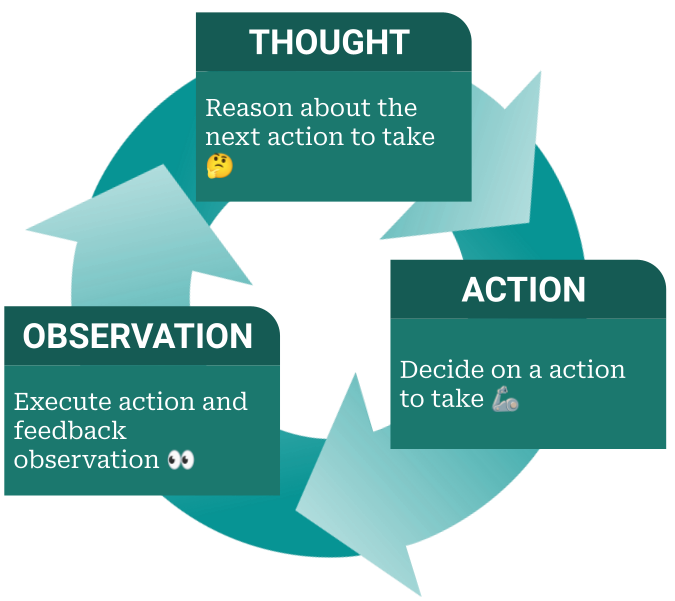

# AppDev-AI-Agent-Lab

# What is an AI agent: 
    An AI agent is a Large Language Model (LLM) that can take actions using tools to get real data and accomplish a goal. AI agents typically follow a ReAct Loop (Reason + Act) that follow a train of actions by itself to accomplish the user's goal. 

# By the end of this lab your agent will:
    * Accept input from the user in a chat loop
    * Use a tool to fetch real data from an API
    * Reason over that data and return an accurate response

    Themes: API
		Music : Last.fm
		Games : RAWG
		Anime : Jikan
        You will build your agent around one fo these themses
    Goal: Understand how agents work under the hood. Doesn't necessarily have to be perfect. THIS IS A VERY BARE BONES AI AGENT

# STEPS:
    1. Cloning the Repo:
        
        
